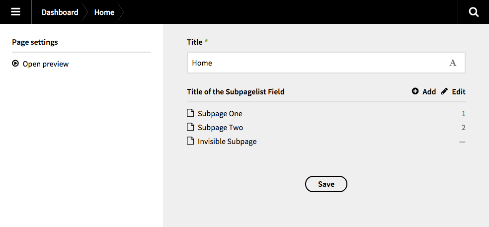

# Kirby 2 // Subpagelist

With this field plugin for [Kirby 2](http://getkirby.com) you can display the list of subpages in the main column of the panel. Simply add the new field „subpagelist” to your blueprints.

### Please notice

With this plugin I basically wanted to level up my Kirby skills (learning by doing). It is inspired by [this topic](http://forum.getkirby.com/t/showing-only-subpages/227) by [thguenther](http://forum.getkirby.com/users/thguenther/activity). If you have any tipps or suggestions, please contact me.

## Preview





## Installation

### Copy & Paste

Add (if necessary) a new `fields` folder to your `site` directory. Then copy the whole content of this repository in a new folder called `subpagelist`. Your directory structure should now look like this:

```
site/
	fields/
		subpagelist/
			assests/
			languages/
			subpagelist.php
			template.php
```

### Git Submodule

It is possible to add this plugin as a Git submodule.

```bash
$ cd your/project/root
$ git submodule add https://github.com/flokosiol/kirby-subpagelist.git site/fields/subpagelist
```

For more information, have a look at [Working with Git](http://getkirby.com/blog/working-with-git) in the Kirby blog.


## Usage

Now you are ready to use the new field `subpagelist` in your blueprints.

```
...
fields:
	mysubpagelist:
		label: My Subpagelist
		type:  subpagelist
...
```


### Optional settings

There are some optional parameter, which change the display of the subpagelist

+ `flip` – returns the subpages in reverse order
+ `limit` – adds pagination after x items
+ `sort` – sorts subpagelist by existing field, e.g. 'Date'. This is useful for news listing.

#### Example

```
...
fields:
	mysubpagelist:
		label: Latest news
		type:  subpagelist

		flip:  true
		limit: 32
		sort:  date desc
...
```
For this to work, a field 'date' must exist in the blueprint of the subpages.

#### Filter

The parameter `filter` needs some more configuration:

+ `visible`– returns only visible pages if set to `TRUE` and only invisible ones if set to `FALSE`
+ `template`– filters by [used](http://getkirby.com/docs/cheatsheet/page/template) (and not by [intended](http://getkirby.com/docs/cheatsheet/page/intended-template)) template
+ `field` – you can also filter by any other field of the subpages, the same as you would do using the [filterBy function](http://getkirby.com/docs/cheatsheet/pages/filterBy). Therefor you have to define the `name`, `value` and optionaly another value to be compared to (see examples below).

### Example 1

```
...
fields:
	mysubpagelist:
		label: My Subpagelist
		type:  subpagelist

		filter:
			visible: true
			template: mytemplate
			field:
				name: description
				value: *=
				compared_to: test
...
```
This will filter all subpages which are `visible`, use the template `mytemplate` and have a field named `description` containing (`*=`) the string `test`.

### Example 2

```
...
fields:
	mysubpagelist:
		label: My Subpagelist
		type:  subpagelist

		filter:
			field:
				name: section
				value: food
...
```
This will filter all subpages with a field named `section` and containing the value `food`.

## Hiding the subpages in the sidebar

To hide the subpages in the sidebar, simply add this to your blueprint (as described in the [Kirby docs](http://getkirby.com/docs/panel/blueprints/page-settings#hide-subpages)):

```
...
pages:
	hide: true
...
```
